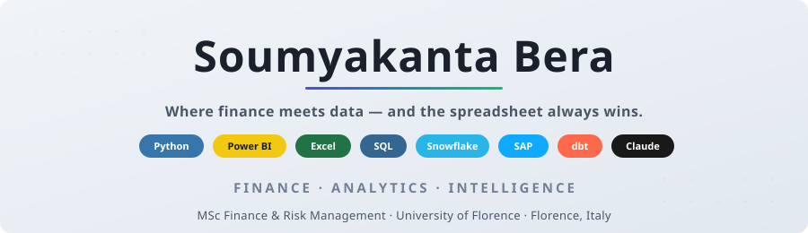

 

&nbsp;
&nbsp;
&nbsp;

 

&nbsp;
&nbsp;

---

### About me

MSc Finance & Risk Management candidate who went from reading balance sheets in India to screening M&A targets in Tuscany — and somehow picked up 13 Forage simulations, 11 certifications, and a thesis about inventory buildup crashing valuations along the way.

I build DCF models, not apps. I debug P&L variances, not code. I speak fluent Excel, conversational Python, and survival Italian.

**Currently looking for:** Finance Analyst · FP&A · Data Analyst · BI Analyst · Risk Analyst roles in 🇳🇱 Netherlands · 🇮🇪 Ireland · 🇪🇺 EU

---

### Stack

**Finance & Valuation**

**Data & Analytics**

-217346?style=for-the-badge&logo=microsoft-excel&logoColor=white)

**SAP & ERP**

**Tools & Platforms**

---

### 13 Forage Simulations

I don't just say "I know investment banking." I've built the models, written the memos, and stress-tested the portfolios. Firm by firm.

---

#### 🏛️ Investment Banking & M&A

<table>
<tr>
<td width="50" align="center"></td>
<td>

**JPMorgan · Investment Banking**

  

Built DCF models for 3 M&A targets from scratch. Developed a full target screening framework, ran accretion/dilution analysis and competitor-bid scenarios, then distilled everything into a two-page executive auction summary.

[🔗 View Project](https://github.com/soumyakantabera/theforage-jpmorgan-investment-banking)

</td>
</tr>
<tr>
<td align="center"></td>
<td>

**Citi · Investment Banking**

  

Comparable company analysis covering 8 peers. Five-year revenue forecasts with 3 scenario cases. Full company profiles with enterprise value breakdowns — everything a deal team needs to say "yes" or "not at that price."

[🔗 View Project](https://github.com/soumyakantabera/theforage-citi-investment-banking)

</td>
</tr>
<tr>
<td align="center"></td>
<td>

**Bank of America · Investment Banking**

  

SWOT + DCF for Webflix. Tore apart 10-K filings of 2 targets for M&A screening. Then evaluated ECM vs DCM capital structure options — because the deal is only as good as the funding behind it.

[🔗 View Project](https://github.com/soumyakantabera/theforage-bofa-investment-banking)

</td>
</tr>
</table>

---

#### 💼 Finance, FP&A & Controllers

<table>
<tr>
<td width="50" align="center"></td>
<td>

**Citi · Finance (FP&A)**

  

Built and maintained dashboards tracking 12 core business KPIs. Monthly credit-card sales forecasts. Supported the annual budgeting cycle. The unglamorous backbone of FP&A — and I enjoy it more than I probably should.

[🔗 View Project](https://github.com/soumyakantabera/theforage-citi-finance)

</td>
</tr>
<tr>
<td align="center"></td>
<td>

**Citi · Services**

  

Designed a tailored credit card product for business clients. Structured a Treasury & Trade Solutions proposal. Built a risk hedging strategy using derivatives — because revenue means nothing if FX eats it.

[🔗 View Project](https://github.com/soumyakantabera/theforage-citi-services)

</td>
</tr>
<tr>
<td align="center"></td>
<td>

**Goldman Sachs · Controllers**

  

Monthly P&L reporting and ledger reconciliation across 4 business units. Regulatory compliance checks. Prepared financial data packs for senior stakeholders — the people who ask "why is this number different from last month?" at 6pm on a Friday.

[🔗 View Project](https://github.com/soumyakantabera/theforage-goldman-sachs-controllers)

</td>
</tr>
</table>

---

#### 🛡️ Risk, Credit & Forensics

<table>
<tr>
<td width="50" align="center"></td>
<td>

**Standard Chartered · Credit Analyst**

  

Led the annual credit review of Green Solutions Manufacturing. Financial health analysis using 15+ ratios with industry benchmarking. Assessed credit risk exposure and presented findings to the credit officer. The kind of work where one wrong ratio ruins someone's Thursday.

[🔗 View Project](https://github.com/soumyakantabera/theforage-standard-chartered-credit-analyst)

</td>
</tr>
<tr>
<td align="center"></td>
<td>

**EY · Forensic & Integrity Services**

  

Full fraud investigation simulation on a $2.3M case. Applied the fraud triangle to 200+ financial documents. Found 7 financial crime indicators and mapped regulatory exposure. Forensic accounting is basically being a detective who's really into spreadsheets.

[🔗 View Project](https://github.com/soumyakantabera/theforage-ey-forensic-and-integrity-services)

</td>
</tr>
<tr>
<td align="center"></td>
<td>

**Goldman Sachs · Risk**

  

Quantitative risk assessment across 12 client profiles and a €450M real estate portfolio. Credit risk exposures via structured due diligence and stress testing. Because "what's the worst that could happen?" is actually a valid analytical question.

[🔗 View Project](https://github.com/soumyakantabera/theforage-goldman-sachs-risk)

</td>
</tr>
</table>

---

#### 📐 Quant Research & Operations

<table>
<tr>
<td width="50" align="center"></td>
<td>

**JPMorgan · Quantitative Research**

  

Built 4 quantitative valuation models and portfolio optimisation algorithms using Python and financial mathematics. Statistical analysis on 50,000+ real market data points. The closest I get to "coding" — and it's still about money.

[🔗 View Project](https://github.com/soumyakantabera/theforage-jpmorgan-quantitative-research)

</td>
</tr>
<tr>
<td align="center"></td>
<td>

**Goldman Sachs · Operations**

  

Streamlined wealth management ops for 3 client segments. Resolved 28 settlement issues, managed €12M in asset transfers, and identified 5 process improvements. Operations isn't sexy — until something breaks and everyone looks at you.

[🔗 View Project](https://github.com/soumyakantabera/theforage-goldman-sachs-operations)

</td>
</tr>
</table>

---

#### 🧠 Strategy Consulting & Advisory

<table>
<tr>
<td width="50" align="center"></td>
<td>

**BCG · Strategy Consulting**

  

Full profitability analysis on the Copier Co. case. Hypothesis-driven market synthesis → 3 structured strategic recommendations → executive-style presentation to a simulated C-suite. Consulting is just finance with more PowerPoint slides and fancier frameworks.

[🔗 View Project](https://github.com/soumyakantabera/theforage-bcg-strategy-consulting)

</td>
</tr>
<tr>
<td align="center"></td>
<td>

**KPMG · Advisory**

  

AI-driven risk advisory analysis across 6 processes. Identified 9 compliance gaps. Presented data-driven remediation recommendations. Because "we should probably fix that" sounds better with a chart attached.

[🔗 View Project](https://github.com/soumyakantabera/theforage-kpmg-advisory)

</td>
</tr>
</table>

---

### Real-world experience

**Valdonica SRL · Tuscany, Italy** — Junior M&A Analyst Support `Oct – Dec 2024`

Screened Italian luxury hospitality M&A targets using EV/EBITDA, revenue growth, and EBIT margin scoring. Built Excel-based DCF + comparable companies analysis with sensitivity across 5 assumptions and 5-year projections. Compiled KPI summaries, P&L reviews, competitor benchmarks, and due diligence packs. Real clients, real stakes, real espresso consumption.

---

### Featured project

TRON + Sparse6 + psychology — 18 character archetypes, works with Claude / ChatGPT / Gemini / any LLM.

---

### 11 Certifications

**Primary**

**Secondary**

**Tertiary**

---

### Thesis

**"Inventory Buildup as an Early Warning Signal: Working-Capital Overhang, Cash-Flow Squeeze, and Valuation Reset"**

`75 firms` · `13 sectors` · `6 super-groups` · `48 formulas` · `FactSet` · `FRED`

When inventory balloons relative to sales, it quietly telegraphs a cash-flow crunch — and the market eventually reprices the risk. Testing whether the signal holds across sectors and what the lead-lag structure looks like.

If that sentence excited you, we should probably talk. *Expected: July 2026*

---

### Education

🇮🇹 **MSc Finance & Risk Management** — University of Florence `Sep 2023 – Jul 2026`
> Corporate Finance · Financial Statement Analysis · Computational Finance · Quantitative Finance & Derivatives · Quantitative Risk Management · Bank Management & Sustainable Finance

🇮🇳 **BBA** — MAKAUT, India `Jul 2019 – Jun 2022`
> Financial Accounting · Cost Accounting · Management Accounting · Financial Management · Managerial Economics

---

### Languages

&nbsp;
&nbsp;
&nbsp;

*Florence forces Italian on you. The espresso makes the grammar bearable.*

---

### Let's talk

If you're hiring Finance · FP&A · Data · BI · Risk talent for a **project, internship, or full-time role** in 🇮🇹 — I'd love to hear from you.

Also available for unreasonable conversations about inventory cycles and working-capital traps.

&nbsp;&nbsp;
&nbsp;&nbsp;

---

*"Finance is the language of value. Data is the grammar. I'm just here trying to write complete sentences."*

